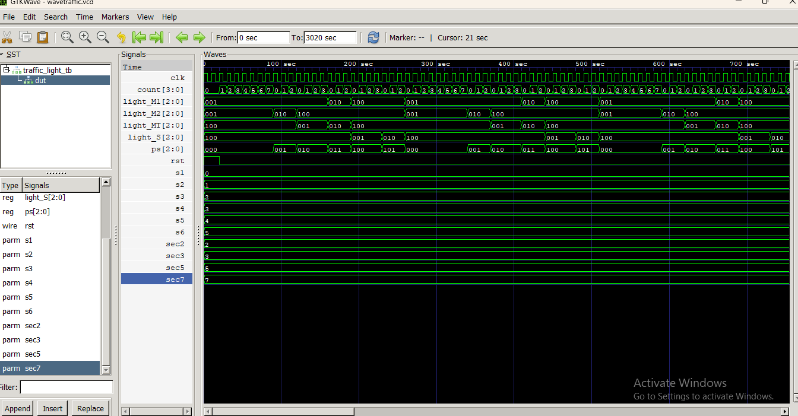
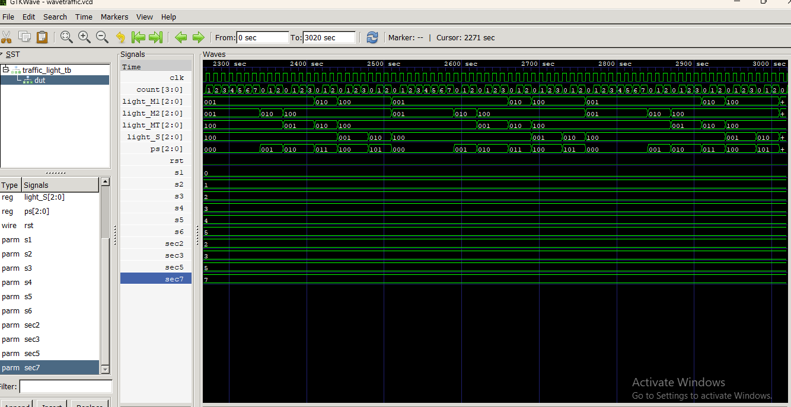

# 🚦 Traffic Light Controller for T-Junction

## 📌 Project Description
A Traffic Light Controller for a T-Junction designed using Verilog HDL and Finite State Machine (FSM). The controller manages traffic flow by controlling signals for:
- Main Road 1 (M1)
- Main Road 2 (M2)
- Main Turn (MT) 
- Side Road (S)

## 🎯 Objectives
- Design an FSM-based traffic light controller.
- Control traffic at a T-Junction.
- Generate Red, Yellow, and Green signals.
- Verify the design through simulation.

## 🛠 Tools Used
- Verilog HDL
- vivado
- VS Code
- Icarus Verilog (iverilog)
- GTKWave

## 🚥 FSM States
- **S1:** M1 & M2 Green
- **S2:** M2 Yellow
- **S3:** MT Green
- **S4:** M1 & MT Yellow
- **S5:** Side Road Green
- **S6:** Side Road Yellow

## ▶️ Simulation Commands

Compile:
```bash
iverilog -o sim traffic_light.v traffic_light_tb.v
```

Run:
```bash
vvp sim
```

View Waveform:
```bash
gtkwave wavetraffic.vcd
```
## 📈 Simulation Waveforms



## ✨ Features
- FSM-based design
- Synchronous state transitions
- Asynchronous reset
- Configurable signal timings
- Verilog testbench for verification

## 📚 Learning Outcomes
- Finite State Machine (FSM)
- Verilog HDL coding
- State transition logic
- Testbench creation
- Simulation using Icarus Verilog
- Waveform analysis using GTKWave

## 👤 Author
**Ameena Sayyed**
